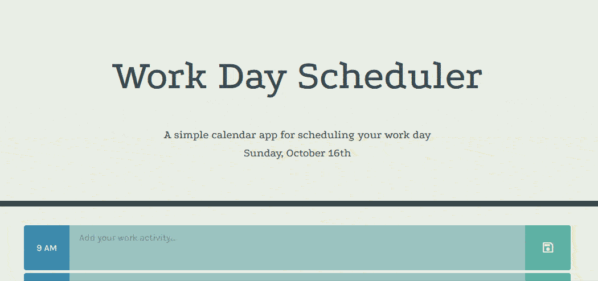

# Work Day Scheduler

## About the Project
The Work Day Scheduler allows the user to keep track of their tasks throughout the day with this handy app. When the user inputs text into a textbox that corresponds to an hour of the workday, the user can press a button to save their changes so that they remain on the page after a page refresh.  

### Features
* Current time and day of the week displayed
* A 9-5 workday scheduler
* Textareas change color to indicate past, present, and future times
* A save button for each hour so that the user's text input can be saved

### Built With
* Bootstrap
* jQuery
* moment.js

## Geting Started
1. Visit [this page](https://awoelf.github.io/work-day-scheduler/) to view the app in your browser.
2. Click on a text area for the desired hour you want to schedule and add text.
3. When you are ready to save your changes, click the save button on the right that corresponds to  the row you want to save.
4. When you refresh, your plans will stay there!

### Prerequisite
Install a modern internet browser and connect to the internet.

## License
Distributed unter the MIT license. See `LICENSE.txt` for more information

## Contact
Alexis Woelffer - [awoelf@outlook.com](mailto:awoelf@outlook.com)

[![LinkedIn][linkedin-shield]][linkedin-url]

<!-- Links and images -->
[linkedin-shield]: https://img.shields.io/badge/-LinkedIn-black.svg?style=for-the-badge&logo=linkedin&colorB=555
[linkedin-url]: https://linkedin.com/in/alexis-w-dev

(<a href="#readme-top">back to top</a>)
